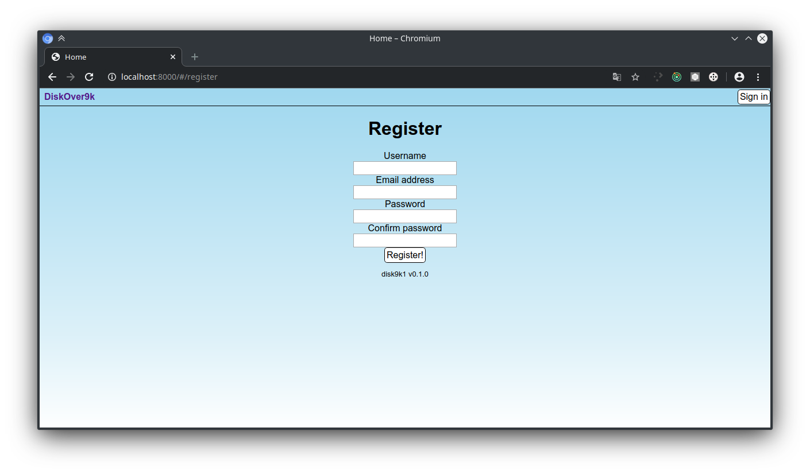

# Disk9k1

A simple web service for uploading and retrieving files with minimal setup and tedium. Inspired by [pomf.se and its clones](https://github.com/tsudoko/long-live-pomf/blob/master/long-live-pomf.md), but with accounts, directories and filenames - a poor man's Google Drive.

# Screenshots




# Launching
Install a nightly Rust toolchain with `rustup`.
Install and start a PostgreSQL server and create a database.
Run `npm run build` in the `js` directory.
Set the following environment variables:
```bash
DATABASE_URL=postgres://you@server:port/base
ADMIN_USERNAME=initial_username_for_the_admin_account
ADMIN_EMAIL=youremail@yourprovider.com
ADMIN_PASSWORD=at_least_sixteen_characters_long
ROCKET_SECRET_KEY=[cryptographic key as a 256-bit base64 encoded string]
```
Run the server with `cargo run`.
# Development
Optionally create an .env file and fill it with the environment variables listed above.
Run `cargo build` to build the server and `cargo run` to run it, then in `js/` run `npm run watch` to have Webpack watch the JS code and rebundle it when it changes.
Go back to the project root and start the server.

Alternatively, if you're on Linux and have [`just`](https://github.com/casey/just), run:
```bash
$ just develop
```
which takes care of all of the above for you - it starts the PostgreSQL SystemD service if it's not on yet, builds the server, runs the `app.js` build script with `npm` and finally starts the server.